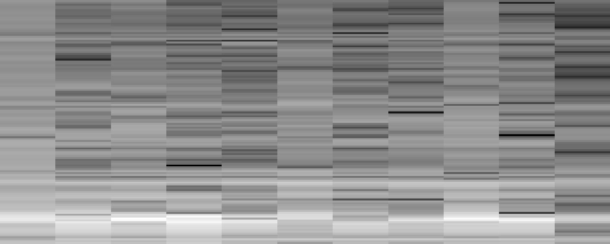
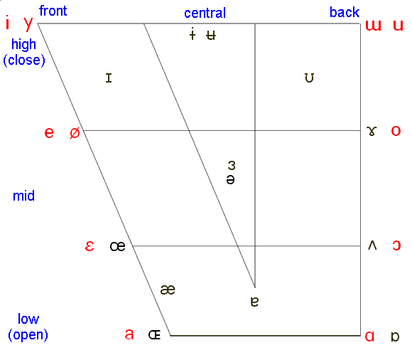
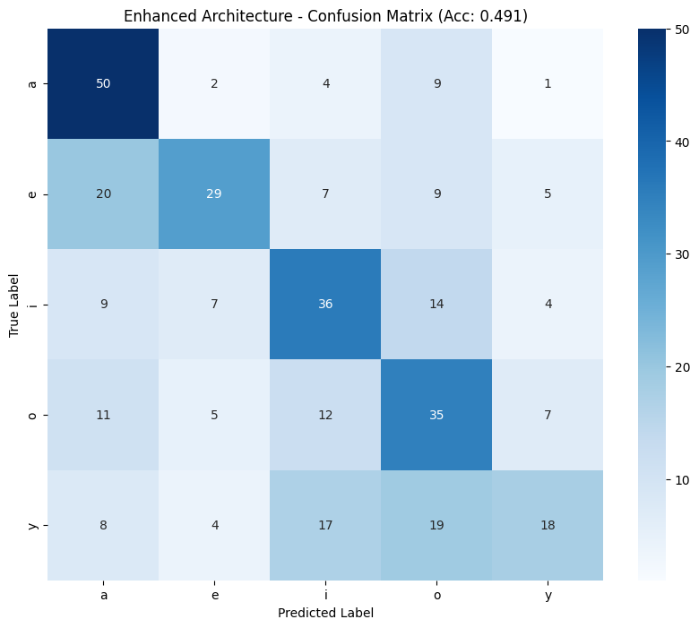
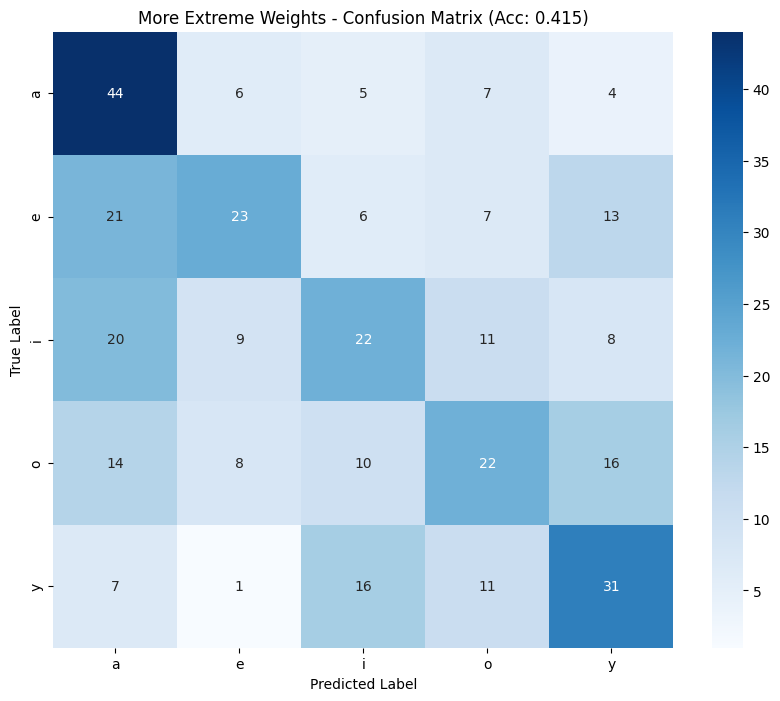
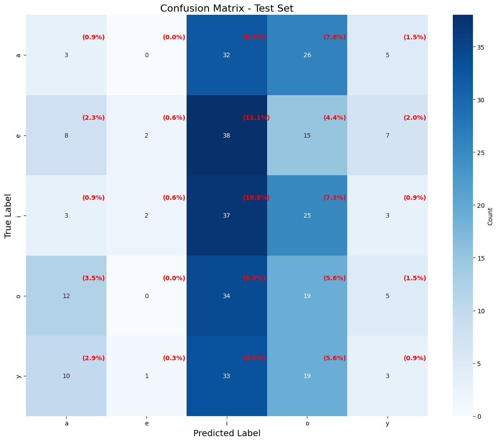

# mmWave Radar-Based Vowel Recognition for Gamified Speech Therapy

**A microphone-free speech recognition prototype combining mmWave radar, deep learning, and real-time visual feedback.**

This undergraduate research project investigates whether subtle facial movements captured by millimeter-wave (mmWave) radar can be used to recognize Turkish vowel articulations **without audio input**. Radar signals are transformed into spectrogram images, classified using a custom convolutional neural network (CNN), and translated into visual feedback in an interactive vowel-placement game.

The system was designed as an exploratory assistive technology concept for people with hearing impairments, particularly those who may benefit from non-auditory articulation feedback. **It is a research proof of concept, not a clinically validated speech therapy device.**

## At a glance

| | |
|---|---|
| **Task** | Five-class Turkish vowel recognition: **a, e, i, o, ü** |
| **Input** | mmWave radar signals (no microphone) |
| **Representation** | 128 × 128 grayscale spectrograms |
| **Model** | Custom TensorFlow/Keras CNN |
| **Best offline test accuracy** | **49.1%** on **342** unseen spectrograms |
| **Real-time output** | Confidence-driven cursor on a vowel chart |

## How it works

```text
TI IWR1843 mmWave radar
          │
          ▼
DCA1000EVM capture card → UDP stream
          │
          ▼
Raw ADC processing → channel averaging → STFT
          │
          ▼
128 × 128 spectrogram
          │
          ▼
CNN → vowel probabilities (a, e, i, o, ü)
          │
          ▼
Interactive vowel chart → visual articulation feedback
```

### Radar signal preprocessing

Raw radar measurements are loaded, padded and reshaped, then averaged across four receiver channels. A short-time Fourier transform (STFT) converts the signal into a time-frequency representation, which is transformed into a grayscale image for CNN classification.



*Example radar spectrogram from the project report (Figure 3.1).*

### CNN classification

The model uses four convolutional blocks, batch normalization, pooling, dropout, and dense classification layers. Three experimental configurations investigated different class-weighting and regularization strategies:

- **Experiment 1:** Enhanced CNN with moderate class weighting — best overall offline performance.
- **Experiment 2:** Stronger class weighting — improved some class-specific results but reduced overall accuracy.
- **Experiment 3:** Alternative architecture with entropy regularization — exhibited pronounced prediction bias.

Training used Adam, learning-rate scheduling, early stopping, and checkpointing. The selected model classifies the five target vowels from radar-derived spectrograms.

### Gamified visual feedback

The Pygame interface uses an IPA-inspired vowel chart. The predicted vowel determines the destination of an on-screen cursor, while model confidence controls its movement. The aim is to give users immediate, intuitive feedback without relying on hearing or audio recordings.



*IPA vowel placement reference from the project report (Figure 2.1).*

## Experimental results

The best-performing model achieved **49.1% accuracy** on a held-out test set of **342 spectrograms**. Performance varied considerably between vowels.

| Vowel | Precision | Recall | F1-score |
|:---:|---:|---:|---:|
| a | 0.510 | 0.758 | 0.610 |
| e | 0.617 | 0.414 | 0.496 |
| i | 0.474 | 0.514 | 0.493 |
| o | 0.407 | 0.500 | 0.449 |
| ü | 0.514 | 0.273 | 0.356 |



*Experiment 1 confusion matrix (Figure 4.1).*

<details>
<summary>View confusion matrices for the other experiments</summary>

**Experiment 2 — stronger class weighting**



**Experiment 3 — alternative regularization**



</details>

**Key observations:** The model was most sensitive to **a** (75.8% recall), while **ü** was particularly challenging (27.3% recall). The experiments highlight how similar articulatory patterns can produce confusable radar signatures, and how weighting and regularization choices affect class balance.

## Real-time prototype

The application integrates radar acquisition, signal processing, TensorFlow inference, spectrogram visualization, and game feedback using a multithreaded Python pipeline.

- **Spectrogram display:** configured for 20 updates per second.
- **Classification:** one prediction per second.
- **Observed inference latency:** typically under 200 ms in reported tests.
- **Hardware:** CPU inference on a laptop (Intel Core i7, 12 GB RAM).

Although the interface was responsive, live testing with two users showed a strong tendency to predict **i**, and **ü** was not detected during those sessions. These findings underline the gap between offline model performance and reliable real-world use.

## Technology stack

**Python · TensorFlow / Keras · NumPy · librosa · OpenCV · PyQt / PyQtGraph · Pygame**

**Hardware:** Texas Instruments IWR1843 mmWave radar and DCA1000EVM capture board.

## Limitations and future work

This prototype demonstrates the feasibility of radar-based, non-acoustic vowel classification, but its accuracy is not sufficient for dependable therapeutic feedback. Future improvements identified in the report include a dual-radar configuration for facial and throat signals, a larger and more diverse speaker dataset, improved generalization and class balance, and clinical evaluation with speech-language professionals.

## Project background

Developed by **Selin Duru Derindag** as a **Computer Engineering undergraduate graduation project** at **Gebze Technical University (2025)**, under the supervision of **Prof. Dr. Yusuf Sinan Akgul**.

For full implementation details, experimental discussion, and references, see the accompanying graduation project report.
